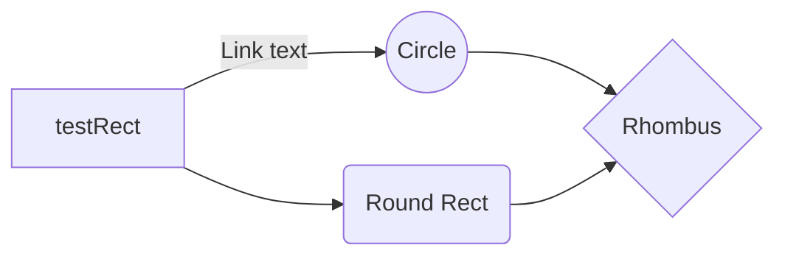
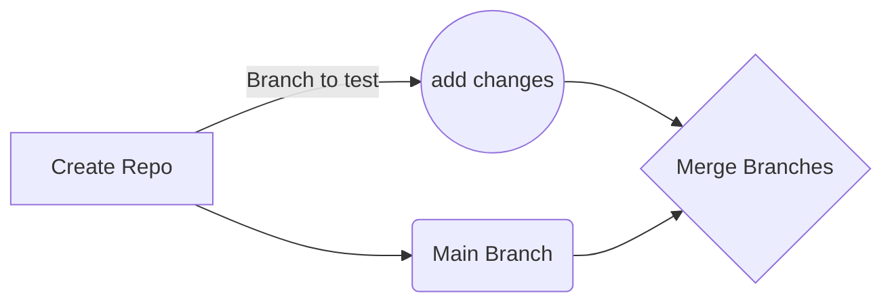

# bootstrap-boilerplate
```
Testing out Bootstrap 5.1 Boilerplate Template CDN and only uses 1 bootstap link in the head tag & 1 script tag at the end of the body tag.
```
## Steps to clone repo
- [x] ~~git clone git@github.com:shintakuson/bootstrap-boilerplate.git~~
- [x] ~~git add .~~
- [X] ~~git commit -m “init commit”~~
- [X] ~~git push -u origin main~~
- [X] ~~Contact the media~~

```included Files
## What is included?
1. index.html
2. css folder
  -styles.css
3. js folder
  -scripts.js
4. img folder





Contributor:
Angel Ramirez
Student
Bitwise
Email@somefakeEmailSite.com